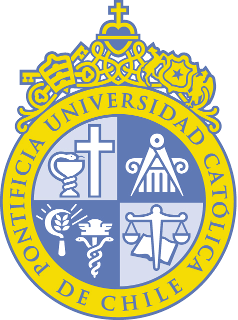

<!--lint disable double-link-->
<!--lint disable double-link-->
# Awesome UC  

> A curated lists of awesome UC [projects](#projects), [software](#software), [tools](#tools) and [course material](#courses) created, related or useful to our community.
> See [Contributing](contributing.md) for information on how to contribute to this list.

---

<!--lint disable remark-lint-double-link-->
## Contents

- [Projects](#projects)
- [Software](#software)
- [Tools](#tools)
- [Courses](#courses)

## Projects

- [directUC](https://github.com/wachunei/directUC) - Google Chrome and Opera extension for logging in to different services.

## Software

- [GitHub Student Pack](https://education.github.com/pack) - Sign up with your @uc.cl email and get free repositories and other goodies.
- [Jetbrains IDEs](https://www.jetbrains.com/student/) - Sign up with your @uc.cl email and download the latest PyCharm, RubyMine and other IDEs (pro) for free.
- [Microsoft Office 365](https://products.office.com/ES/student/office-in-education) - Get a free license using your @uc.cl email.

## Tools

- [BALU](https://github.com/domingomery/Balu) - A Matlab toolbox for computer vision, pattern recognition and image processing.

## Courses

Here is the listing of courses and their organizations.

> Follow the recommended guide of standardization when starting a new course at the [Guides](#guides) section.

### IIC2233 - Programación Avanzada

- [2015-1](https://github.com/IIC2233-2015-1)
- [2015-2](https://github.com/IIC2233-2015-2)
- [2016-1](https://github.com/IIC2233-2016-1)
- [2016-2](https://github.com/IIC2233-2016-02)
- [2017-1 and forward](https://github.com/IIC2233)

### IIC2343 - Arquitectura de Computadores

- [2016-2](https://github.com/IIC2343-2016-2)
### IIC2133 - Estructuras de Datos y Algoritmos
- [All periods](https://github.com/IIC2133-PUC/)

### IIC2513 - Tecnologías y Aplicaciones Web

- [2015-1](https://github.com/IIC2513-2015-1)
- [2015-2](https://github.com/IIC2513-2015-2)
- [2017-1](https://github.com/IIC2513-2017-1)

### IIC2143 - Ingeniería de Software

- [2016-1](https://github.com/IIC2143-2016-1)
- [2017](https://github.com/IIC2143-2017)

### IIC2113 - Diseño Detallado de Software

- [2016-2](https://github.com/IIC2113-2016-2)

### IIC2173 - Arquitectura de Sistemas de Software

- [2016-2](https://github.com/IIC2173-2016-2)

### IIC2154 - Proyecto de Especialidad

- [All periods](https://github.com/iic2154-uc-cl)

### IIC3585 - Diseño Avanzado de Aplicaciones Web

- [2015-2](https://github.com/IIC3585-2015-2)
- [2016-2](https://github.com/IIC3585-2016-2)
